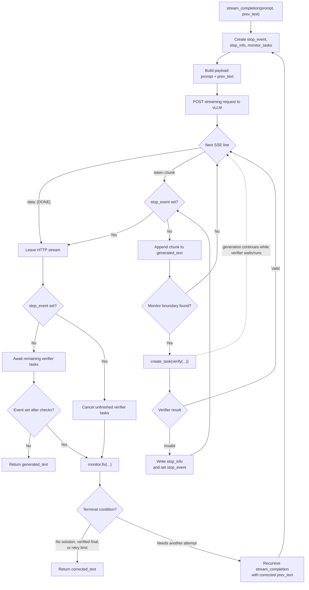

# InterWhen Code Walkthrough

InterWhen is implemented around a **stream -> extract state -> verify -> roll
back -> inject feedback -> resume** loop. The model follows one main
trajectory, while temporary side generations expose its current reasoning
state to deterministic verifiers.

```text
Main model streams reasoning
          |
          +-- boundary detected
          |       |
          |       +-- fork partial trace + extraction prompt
          |                       |
          |                       v
          |               structured state
          |                       |
          |                       v
          |                    verifier
          |                  /          \
          |              valid          invalid
          |                |               |
          v                v               v
     keep streaming    keep streaming   discard speculative suffix
                                       append feedback
                                       resume generation
```

## 1. The central runtime loop

Start with [`interwhen/interject.py`](./interwhen/interject.py), particularly
`stream_completion()`.

It:

1. Sends `prompt + generated_text` to the vLLM `/v1/completions` endpoint.
2. Reads streamed Server-Sent Events token by token.
3. Appends each chunk to `generated_text`.
4. Calls the monitor's `step_extractor()` to determine whether the current
   partial trace is worth checking.
5. Starts `verify()` as an asynchronous task.
6. Continues generating speculatively while verification runs.
7. If verification reports a violation, stops the HTTP stream, calls `fix()`,
   and recursively restarts generation with the corrected prefix.

The critical code is:

```python
stepFlag, step = monitors[0].step_extractor(chunk, generated_text)

if stepFlag:
    task = asyncio.create_task(
        monitors[0].verify(
            step,
            len(generated_text) - len(chunk),
            stop_event,
            stop_info,
        )
    )
```

A verifier signals an intervention through shared state:

```python
event_info["generated_text"] = step
event_info["feedback"] = feedback
event_info["phase"] = "rollback_to_thinking"
event.set()
```

The runtime then creates a corrected prefix and resumes generation:

```python
corrected_text = await monitors[0].fix(generated_text, stop_info)

return await stream_completion(
    prompt,
    prev_text=corrected_text,
    ...
)
```

This restart is how rollback works. The monitor normally stores the trace as it
existed at the verification boundary. Any tokens generated after that boundary
while verification was running are discarded.

### Complete walkthrough of `stream_completion()`

The function signature is:

```python
async def stream_completion(
    prompt,
    prev_text="",
    llm_server=None,
    monitors=[],
    add_delay=False,
    num_calls_index=0,
    termination_requires_validation=False,
    async_execution=True,
    tokenizer=None,
):
```

| Parameter | Meaning |
|---|---|
| `prompt` | Original prompt sent to the model |
| `prev_text` | Text retained from an earlier generation attempt; empty on the first call |
| `llm_server` | Dictionary containing the vLLM URL, HTTP headers, and generation payload |
| `monitors` | Monitor instances that inspect the generated text; currently only `monitors[0]` is used |
| `add_delay` | Adds a short delay after each chunk, mainly for demonstrations |
| `num_calls_index` | Counts correction/restart attempts |
| `termination_requires_validation` | Present in the API but currently unused |
| `async_execution` | If `True`, generation continues while verification runs |
| `tokenizer` | Hugging Face tokenizer used to count input tokens |

#### A. Initialize state for this generation attempt

```python
stop_event = asyncio.Event()
stop_info = {
    "generated_text": None,
    "feedback": None,
    "token_index": None,
}
monitor_tasks = []
generated_text = prev_text
```

- `stop_event` is an async signal shared by the stream and verifier tasks.
- `stop_info` is where a verifier writes the trace to retain and the feedback
  to inject.
- `monitor_tasks` tracks all verifier tasks started during this attempt.
- `generated_text` begins with the corrected text from the previous attempt.

Each recursive call creates a fresh event, fresh task list, and fresh HTTP
request.

#### B. Build the vLLM request

```python
llm_server["payload"]["prompt"] = prompt + generated_text
token_count = count_tokens(llm_server["payload"]["prompt"], tokenizer)
llm_server["payload"]["max_tokens"] = (
    llm_server["payload"]["context_length"] - token_count
)
```

The model receives both the original prompt and all retained generation:

```text
actual model input = original prompt + corrected/previous text
```

`max_tokens` is set to the remaining context-window capacity.

#### C. Open and consume the streaming HTTP response

```python
async with httpx.AsyncClient(timeout=None) as client:
    async with client.stream(
        "POST",
        llm_server["url"],
        headers=llm_server["headers"],
        json=llm_server["payload"],
    ) as response:
        async for line in response.aiter_lines():
```

vLLM sends Server-Sent Event lines as tokens or short text chunks become
available:

```text
data: {"choices": [{"text": "Try"}]}
data: {"choices": [{"text": " 8 / 2"}]}
data: {"choices": [{"text": " = 4.\n"}]}
data: [DONE]
```

The code removes the `data: ` prefix, parses the JSON, and extracts:

```python
chunk = json.loads(data)["choices"][0]["text"]
```

Malformed lines are skipped. `[DONE]` means the server has finished generating.

#### D. Append the chunk and possibly start a verifier

```python
generated_text += chunk

if len(monitors) > 0 and not stop_event.is_set():
    stepFlag, step = monitors[0].step_extractor(chunk, generated_text)
```

`step_extractor()` decides whether the latest chunk completed a useful
verification boundary, such as:

- a newline;
- a `Wait` reflection;
- a complete structured reasoning step;
- a `\boxed{...}` answer.

If a boundary is found, verification is scheduled:

```python
task = asyncio.create_task(
    monitors[0].verify(
        step,
        len(generated_text) - len(chunk),
        stop_event,
        stop_info,
    )
)
monitor_tasks.append(task)
```

`asyncio.create_task()` does not normally create another operating-system
thread. It schedules the verifier on the same event loop. Whenever the HTTP
stream is waiting for another network chunk, the event loop can advance the
verifier task.

The value named `token_index` is actually the character offset where the
current chunk begins:

```python
len(generated_text) - len(chunk)
```

When `async_execution=False`, the function immediately does `await task`.
Generation therefore pauses at every verification boundary until that
verification finishes.

#### E. How a verifier stops generation

For a valid state, `verify()` simply returns and generation continues.

For an invalid state, it writes correction information and sets the event:

```python
event_info["generated_text"] = step
event_info["feedback"] = verifier_feedback
event.set()
```

The main streaming loop checks this event before accepting another chunk:

```python
if stop_event.is_set():
    break
```

Because verification is asynchronous, the model may have generated additional
chunks after the checked boundary. Those chunks are speculative and are not
necessarily included in `stop_info["generated_text"]`.

#### F. Finish or cancel verifier tasks

After leaving the HTTP stream:

```python
if stop_event.is_set():
    await _cancel_tasks(monitor_tasks)
else:
    await asyncio.gather(*monitor_tasks, return_exceptions=True)
```

- If one verifier requested an intervention, unfinished verifier tasks are
  cancelled.
- Otherwise, the function waits for every scheduled verifier to finish before
  deciding that the output is safe to return.

#### G. Fix, restart, or return

If the event was set, the selected monitor builds a corrected trace:

```python
corrected_text = await monitors[0].fix(generated_text, stop_info)
```

There are four possible outcomes:

1. After 50 correction attempts, return the current text.
2. If feedback is exactly `the answer is \boxed{no solution}`, return the
   corrected text and abstain.
3. If `phase == "final_answer_correct"`, return the verified answer.
4. Otherwise, recursively call `stream_completion()` with
   `prev_text=corrected_text`.

If no verifier sets the event, the function returns the completed
`generated_text`.

### Control-flow graph



### Concrete Game of 24 example

Assume the prompt is:

```text
Use 1, 2, 6, and 8 exactly once to make 24.
```

The execution can proceed like this:

| Time | Main stream | Monitor |
|---|---|---|
| 1 | Generates `Try 8 / 2 = 4.\n` | Newline boundary detected |
| 2 | Continues generating | Side stream extracts `{8 / 2}` |
| 3 | Continues generating | Verifier sees intermediate state `[4, 1, 6]` can still reach 24 |
| 4 | Generates another attempted expression | Another boundary starts another verifier |
| 5 | May generate speculative text after that boundary | Verifier discovers the expression is a dead end |
| 6 | Stream notices `stop_event` and stops | Monitor stores the checked prefix plus corrective feedback |
| 7 | Recursive call starts with corrected text | Model tries a different approach |
| 8 | Generates `(8 / 2) * 6 * 1` | Verifier confirms it uses every number and equals 24 |
| 9 | Monitor injects `</think>` and final-answer guidance | Model emits the verified final answer |

The corrected input for the recursive call looks conceptually like:

```text
Original prompt
+ reasoning retained up to the checked boundary
+ "Wait, that expression is a dead end. Let me try a different approach."
```

Any speculative text generated after the rejected boundary is omitted. This is
the key mechanism that lets InterWhen correct one trajectory rather than
discarding the whole response and starting from scratch.

### What "forking inference" means in this code

There is no explicit vLLM `fork_kv_cache()` operation. A fork is implemented
as another completion request whose prompt contains the same prefix:

```python
payload["prompt"] = self.prompt + text_so_far
```

The server is configured with `"prompt_cache": True` in
[`interwhen/utils/llm.py`](./interwhen/utils/llm.py), so vLLM may reuse the
cached prefix. Conceptually this is a fork; operationally it is a second HTTP
inference request from the same textual state.

## 2. The monitor abstraction

The interface is in
[`interwhen/monitors/base.py`](./interwhen/monitors/base.py).

Every `VerifyMonitor` implements three operations:

| Method | Responsibility |
|---|---|
| `step_extractor(chunk, generated_text)` | Decide **when** to check and return the trace or state to inspect |
| `verify(step, token_index, event, event_info)` | Decide whether the state is valid and signal an intervention |
| `fix(generated_text, event_info)` | Construct the new prefix from which generation resumes |

This separation corresponds closely to the paper:

```text
monitoring policy = when to look
state extraction  = what the model currently believes
verifier          = whether that state is allowed
intervention      = how to steer the model after rejection
```

The monitor is not necessarily the verifier. For example, the Game of 24
monitor handles scheduling, side-stream inference, and feedback, while
arithmetic functions perform the actual verification.

## 3. The main paper-style implementation: thinking-phase monitors

The clearest implementations are:

- [`thinkingPhaseVerifierGame24.py`](./interwhen/monitors/thinkingPhaseVerifierGame24.py)
- [`thinkingPhaseVerifierMaze.py`](./interwhen/monitors/thinkingPhaseVerifierMaze.py)
- [`thinkingPhaseVerifierSpatialMap.py`](./interwhen/monitors/thinkingPhaseVerifierSpatialMap.py)

These monitors have two phases.

### Phase 1: inspect the hidden reasoning trace

While `</think>` has not appeared, the monitor counts boundaries, usually
newlines:

```python
if generated_text.endswith("\n"):
    if past_warmup % self.newline_threshold == 0:
        return True, generated_text
```

At that point it forks generation and appends a prompt that asks the model to
expose its current state in a parseable format.

For Game of 24, the injected suffix is:

```python
"</think>\nThe expression that I found till now is {"
```

The side stream generates only about 20 tokens. If the main trace is currently
considering `(8 / 2) * 6`, the fork might complete:

```text
{(8 / 2) * 6}
```

The main model is therefore used as its own state extractor. The framework
does not require the original reasoning trace itself to follow a rigid schema.

### Phase 2: verify the final answer

When the model naturally emits `</think>`, the Game of 24 monitor injects a
structured final-answer prompt:

```python
FINAL_EXPRESSION_PROMPT = "\nThe final expression is \\boxed"
```

It waits for a complete `\boxed{...}`, extracts the expression, and verifies it
again. A correct final answer sets:

```python
event_info["phase"] = "final_answer_correct"
```

This causes `stream_completion()` to return instead of starting another
continuation.

## 4. Worked example: Game of 24

The complete monitor is
[`interwhen/monitors/thinkingPhaseVerifierGame24.py`](./interwhen/monitors/thinkingPhaseVerifierGame24.py).
Its domain verifier is `verify_expression()` near the top of that file.

Given four original numbers, it checks:

1. Every number in the expression came from the input multiset.
2. No number was reused.
3. The expression can be evaluated.
4. If all numbers are used, the result equals 24.
5. If only some numbers are used, the resulting intermediate value plus the
   unused numbers can still reach 24.

The last check is especially important. Suppose the inputs are:

```text
[1, 2, 6, 8]
```

and the model's current partial expression is:

```text
8 / 2
```

That evaluates to `4`, leaving `[1, 6]`. The verifier calls:

```python
can_reach_24([4, 1, 6])
```

Because `4 * 6 * 1 = 24`, this is a valid partial state, so the main model
continues without intervention.

If the partial expression is a mathematical dead end, the monitor injects
feedback resembling:

```text
Wait, the expression ... does not work.
The remaining numbers cannot reach 24.
I must not reuse this expression...
```

Generation then resumes from that feedback.

If the side stream already exposes a complete valid expression, the monitor
performs early termination:

```text
Wait, the expression ... has been verified to equal 24
using all the given numbers. This will be my final answer.
</think>
```

The exhaustive search used for reachability lives in
[`interwhen/utils/game24_verifier.py`](./interwhen/utils/game24_verifier.py).
It enumerates:

- number permutations;
- the operators `+`, `-`, `*`, and `/`;
- possible parenthesizations.

Because there are only four numbers, exhaustive verification is inexpensive.

## 5. How the other reasoning domains differ

The framework remains the same; only extraction and verification change.

| Domain | Extracted state | Verifier |
|---|---|---|
| Game of 24 | Current arithmetic expression | Python arithmetic plus exhaustive reachability |
| Maze | Current path, positions, directions, and turn counts | Deterministic grid-transition checks |
| SpatialMap | Directional claims between entities | Z3 satisfiability and entailment |
| ZebraLogic | JSON house assignments | Z3 constraints |
| Verina | Lean code or specification | Lean compiler |
| Medical examples | Structured medical claims | Domain-specific medical verifier |

### Maze

[`thinkingPhaseVerifierMaze.py`](./interwhen/monitors/thinkingPhaseVerifierMaze.py)
asks the side stream to produce structured moves:

```text
>>> STEP 1: Move DOWN from (r1, c1) to (r2, c2)
Current position: ...
Previous direction: ...
Current direction: ...
Turn type: ...
Running count: Right=..., Left=...
```

[`interwhen/utils/maze_verifier.py`](./interwhen/utils/maze_verifier.py)
verifies each transition:

- `from_pos` is the actual current position;
- the direction agrees with the coordinate delta;
- `to_pos` is not a wall;
- the claimed right or left turn is correct;
- running counts are correct;
- the final position reaches `E`.

### SpatialMap

[`thinkingPhaseVerifierSpatialMap.py`](./interwhen/monitors/thinkingPhaseVerifierSpatialMap.py)
extracts claims such as:

```text
A is northwest of B
```

[`interwhen/utils/spatialmap_verifier.py`](./interwhen/utils/spatialmap_verifier.py)
gives every object symbolic coordinates:

```python
A_x = Real("A_x")
A_y = Real("A_y")
```

`A` northwest of `B` becomes:

```python
And(A_x < B_x, A_y > B_y)
```

To test a new claim, the verifier temporarily adds the constraint:

```python
solver.push()
solver.add(new_constraint)
valid = solver.check() == sat
solver.pop()
```

For final answers, some checks use entailment: negate the proposed relation
and check whether the result is `unsat`. If its negation is impossible, the
relation must follow from the original constraints.

## 6. The older structured-step path

[`interwhen/monitors/stepVerifier.py`](./interwhen/monitors/stepVerifier.py)
contains an older and simpler implementation.

Here, the model is prompted in advance to generate parseable steps. The
monitor waits until a complete regex-matching step appears, verifies it, and
injects feedback after failure.

| Structured-step monitor | Thinking-phase monitor |
|---|---|
| Requires model output to follow a schema | Works with an ordinary reasoning prompt |
| Parses steps directly from the main output | Forks generation to extract structured state |
| Usually verifies after `</think>` | Verifies while reasoning is still happening |
| Simpler implementation | Closer to the paper's general proposal |

## 7. Early-stopping monitors

[`interwhen/monitors/earlyStopping.py`](./interwhen/monitors/earlyStopping.py)
and [`interwhen/monitors/k_stable.py`](./interwhen/monitors/k_stable.py) use
the same intervention mechanism for efficiency rather than correctness.

- **K-Stable:** stop when the same normalized answer appears `k` consecutive
  times.
- **EAT:** probe the likely answer after `Wait`; stop when the exponential
  moving variance of token entropy drops below a threshold.
- **DEER:** generate or probe an answer after `Wait`; stop when the geometric
  mean token confidence exceeds a threshold.

Their `fix()` methods generally append `</think>`, forcing the model to leave
reasoning mode and produce its answer.

## 8. Agentic policy verification is a separate integration

The Tau2Bench implementation does not use `stream_completion()`. It inserts
verification directly between an agent and its tool environment.

The important hook is
[`examples/AgenticBenchmarks/tau2bench/orchestrator.py`](./examples/AgenticBenchmarks/tau2bench/orchestrator.py):

```python
feedback = self.tool_call_verifier.verify(
    tool_name=tool_call.name,
    tool_args=tool_call.arguments,
    conversation=conversation,
)

if feedback:
    # Return an error ToolMessage without executing the tool
    continue

tool_result = self.environment.get_response(tool_call)
```

The resulting flow is:

```text
agent proposes tool call
          |
          v
   PRE policy verifier
      /          \
   reject        allow
     |             |
feedback to      execute tool
agent only           |
                     v
               POST verifier
                     |
               annotate result
```

This is the implementation of blocking irreversible actions. A rejected write
call never reaches the environment.

`PolicyVerifier.verify()` in
[`examples/AgenticBenchmarks/tau2bench/verifiers/verifier_python/verifier.py`](./examples/AgenticBenchmarks/tau2bench/verifiers/verifier_python/verifier.py)
dispatches to domain-specific policy rules using:

- tool name;
- tool arguments;
- recent conversation;
- current database state.

The violation is returned as a `[VERIFIER]` tool response, so the agent sees
the policy failure and can choose another action without restarting the entire
task.

## 9. Offline verifier synthesis

The paper's offline phase is under:

```text
examples/AgenticBenchmarks/tau2bench/autoformalization_pipeline/
```

Its flow is:

```text
policy.md + tools.py + DB schema + workflow
                  |
                  v
Copilot agent generates PolicyChecker.lean
                  |
                  +-- manifest.json
                  v
Jinja renders LeanMain.lean
                  |
                  v
lake build -> policychecker binary
                  |
                  v
Jinja renders Python glue
```

Important files:

- [`generate_spec.py`](./examples/AgenticBenchmarks/tau2bench/autoformalization_pipeline/generate_spec.py):
  launches a Copilot agent to generate and build the Lean specification.
- [`manifest.py`](./examples/AgenticBenchmarks/tau2bench/autoformalization_pipeline/manifest.py):
  defines the contract between generated Lean and Python.
- [`generate_runner.py`](./examples/AgenticBenchmarks/tau2bench/autoformalization_pipeline/generate_runner.py):
  generates the JSON-line Lean executable.
- [`generate_glue.py`](./examples/AgenticBenchmarks/tau2bench/autoformalization_pipeline/generate_glue.py):
  maps runtime tool calls and DB snapshots into Lean inputs.
- [`glue_runtime.py`](./examples/AgenticBenchmarks/tau2bench/autoformalization_pipeline/glue_runtime.py):
  maintains a long-lived Lean subprocess and exchanges one JSON request and
  response per line.

A generated rule is represented in `manifest.json` approximately as:

```json
{
  "name": "billOverdue",
  "phase": "pre",
  "tool": "send_payment_request",
  "source": "db",
  "args_from": [
    ["bill", "args.bill_id", "BillId"]
  ]
}
```

The generated glue snapshots the database, normalizes Python values, asks a
small LLM for any unstructured hypotheses, and sends the final request to
Lean.

## 10. Important implementation limitations

Several details are narrower than the architecture described in the paper:

- `stream_completion()` accepts `monitors`, but currently calls only
  `monitors[0]`; monitor composition and priorities are not implemented.
- `token_index` is usually a character offset, despite its name.
- `termination_requires_validation` is accepted but unused.
- Triggers rely heavily on exact strings such as newlines, `Wait`, `<think>`,
  and `</think>`.
- If a side stream cannot extract state, most monitors let generation
  continue.
- The Lean runtime skips Lean rules when the binary is unavailable or a query
  fails.
- `PolicyVerifier` allows an identical tool call after it has been blocked
  `max_feedback_per_tool` times.
- `check_completion()` in the Python policy verifier currently starts with
  `return None`, so the completion-nudge logic below it is disabled.
- The repository is partly a library and partly benchmark overlays; the
  agentic integrations are not exposed through the small top-level
  `interwhen` API.

## 11. Recommended reading order

1. [`interwhen/interject.py`](./interwhen/interject.py)
2. [`interwhen/monitors/base.py`](./interwhen/monitors/base.py)
3. [`interwhen/monitors/thinkingPhaseVerifierGame24.py`](./interwhen/monitors/thinkingPhaseVerifierGame24.py)
4. [`interwhen/utils/game24_verifier.py`](./interwhen/utils/game24_verifier.py)
5. [`examples/TTSwithVerification/interwhen/game24_example.py`](./examples/TTSwithVerification/interwhen/game24_example.py)
6. [`examples/AgenticBenchmarks/tau2bench/orchestrator.py`](./examples/AgenticBenchmarks/tau2bench/orchestrator.py)
7. [`examples/AgenticBenchmarks/tau2bench/autoformalization_pipeline/README.md`](./examples/AgenticBenchmarks/tau2bench/autoformalization_pipeline/README.md)
